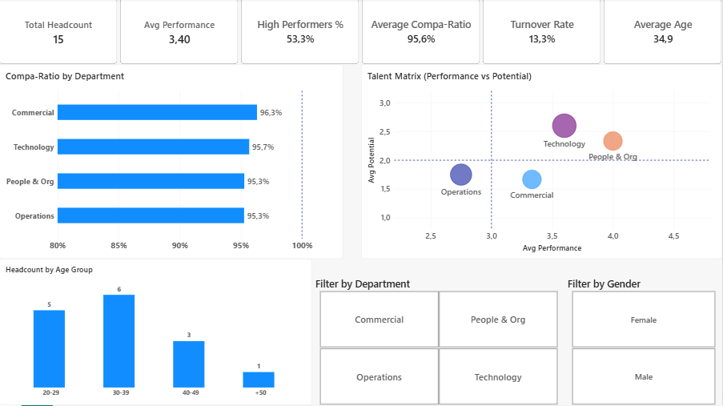
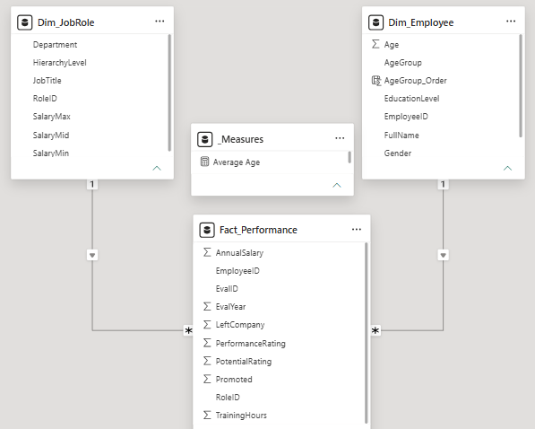

# 📊 People Analytics & Internal Equity Dashboard | Power BI

[](https://powerbi.microsoft.com/)
[](https://docs.microsoft.com/dax/)
[](#data-architecture--modeling)

---

## 📌 Executive Summary
This Power BI reporting solution provides HR leadership and department directors with actionable visibility into **workforce demographics, retention risks, and internal compensation equity**. 

Rather than relying on unstandardized external market benchmarks, the dashboard evaluates salary positioning directly against **internal pay grade midpoints**, enabling granular talent governance and mitigating pay disparities across organizational tiers.

---

## 🖼️ Dashboard Preview



---

## 🎯 Key Business Problems Solved
* **Internal Pay Equity & Compa-Ratio:** Evaluated employee compensation relative to internal pay band medians to pinpoint underpaid high-performers and mitigate attrition risk.
* **Talent Segmentation:** Tracked headcounts, turnover rates, and tenure distribution across business units.
* **Modular Decision-Making:** Designed a clean, accessible UI allowing stakeholders to drill down by department, performance rating, and tenure band.

---

## 🏗️ Data Architecture & Modeling
The semantic model is engineered strictly following the **Star Schema (Kimball methodology)**, decoupling transactional facts from descriptive dimensions to optimize VertiPaq engine performance and ensure bi-directional filter integrity.



* **Fact Table:** `Fact_Performance`
* **Dimension Tables:** `Dim_JobRole`, `Dim_Employee`
* **Measure Repository:** `_Measures`

---

## 📐 Selected DAX Measures

### 1. Internal Compa-Ratio Calculation
Evaluates individual employee compensation against the predefined internal pay grade midpoint:

```dax
Compa-Ratio = 
DIVIDE(
    SELECTEDVALUE(Fact_Performance[AnnualSalary]),
    RELATED(Dim_JobRole[SalaryMid]),
    BLANK()
)

```

### 2. High-Performer Retention Rate

Tracks retention specifically within top-tier performance segments to isolate key-talent flight risks:

```dax
High Performer Retention % = 
VAR TotalHighPerformers = 
    CALCULATE(
        COUNTROWS(Fact_Performance),
        Fact_Performance[PerformanceRating] >= 4
    )
VAR RetainedHighPerformers = 
    CALCULATE(
        COUNTROWS(Fact_Performance),
        Fact_Performance[PerformanceRating] >= 4,
        Fact_Performance[LeftCompany] = 0
    )
RETURN
DIVIDE(RetainedHighPerformers, TotalHighPerformers, 0)

```

---

## 🔍 Key Insights & Strategic Findings

1. **Compensation Alignment:** Identified departments where average compa-ratio skewed below 0.88 despite sustained top-quartile performance ratings.
2. **Tenure vs. Turnover Friction:** Detected early-career attrition inflection points concentrated within the 12–18 month tenure window.
3. **Headcount Governance:** Highlighted organizational tiers where managerial spans of control were disproportionately distributed.

---

## 🛠️ Tools & Technologies Used

* **Power BI Desktop:** Advanced data visualization, bookmarks, parameter-driven slicing.
* **Power Query (M):** Data ingestion, schema standardization, data type optimization.
* **DAX:** Dynamic aggregation, time intelligence, and custom index measures.

---

## 📬 Contact & Professional Profile

* **Author:** Gonçalo Matias Santos
* **Email:** goncalo.matias.data@gmail.com
